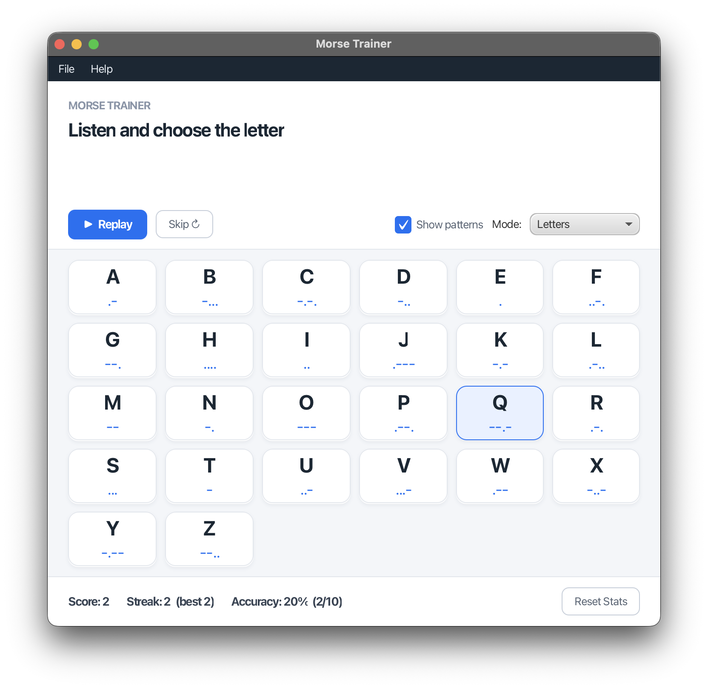

# Morse Trainer — Spring Boot + JavaFX

A desktop game for learning Morse code. The app plays the Morse code for a
random letter; you pick the matching letter from a grid. Correct answers build
your streak; the app tracks score and accuracy.



---

## How it plays

1. A round starts and the Morse code for a hidden letter plays automatically.
2. The alphabet is laid out as a grid of buttons.
3. Click the letter you think you heard.
   - **Correct** → the button flashes green, your score and streak go up, and
     the next round starts after a brief pause.
   - **Wrong** → the button flashes red, your streak resets, and you can try
     again (the round stays active until you get it right).
4. **Replay** replays the current letter's tone. **Skip** moves on without
   penalty.
5. Switch **Mode** between *Letters*, *Digits*, and *Letters + Digits*.

If no audio device is available, the app falls back to showing the dot/dash
pattern so the game is still playable.

---

## Requirements

| Tool | Version |
|------|---------|
| JDK | 21+ |
| Maven | 3.9+ |

JavaFX is pulled in as a Maven dependency, so no separate SDK install is needed.

---

## Build & run

```bash
# Run in development (JavaFX plugin handles the module path)
mvn javafx:run

# Or build a runnable Spring Boot jar
mvn clean package
java -jar target/morse-game-1.0.0.jar
```

---

## Tests

```bash
mvn test
```

The `GameServiceTest` suite covers the game logic with a seeded random for
deterministic rounds: round lifecycle, correct/incorrect scoring, streak
tracking, accuracy calculation, per-mode character pools, and the
no-immediate-repeat rule.

---

## Architecture — Spring Boot + JavaFX

The classic integration pattern is used: **JavaFX owns the process, Spring owns
the beans.**

```
main()  →  Application.launch(JavaFxApplication)
                     │
        JavaFxApplication.init()   ── boots Spring via SpringApplicationBuilder
                     │
        JavaFxApplication.start(Stage)
                     │
                     └─ context.publishEvent(new StageReadyEvent(stage))
                                    │
                     GameView.onStageReady(...)   ←  @EventListener (a Spring bean)
                                    │
                        builds the Scene, shows the Stage, starts round 1
```

### Why this shape?

JavaFX requires its own launcher to own the main thread, and it constructs the
primary `Stage` for you inside `start()`. Spring, meanwhile, wants to create and
wire beans up front. The two are bridged by:

- Booting the Spring context inside JavaFX's `init()` phase.
- Publishing the `Stage` into Spring as an **`ApplicationEvent`**
  (`StageReadyEvent`), which a Spring-managed `@Component` (`GameView`) receives
  via `@EventListener`.

This keeps the UI class a first-class Spring bean — so it gets constructor
injection of `GameService` and `MorsePlayer` — without Spring ever needing to
know about JavaFX's lifecycle.

### Beans

| Bean | Kind | Role |
|------|------|------|
| `GameService` | `@Service` | Core game logic: round selection, scoring, modes |
| `MorseConverter` | `@Component` | Text ↔ Morse encoding (shared) |
| `AudioSettings` | `@Bean` (in `AppConfig`) | Audio parameters (sample rate, frequency, dot length) |
| `MorsePlayer` | `@Bean` (in `AppConfig`) | Generates tones via `javax.sound.sampled`; `Closeable`, so Spring closes it on shutdown |
| `GameView` | `@Component` | The JavaFX UI; listens for `StageReadyEvent` |

`AudioSettings` and `MorsePlayer` are declared with `@Bean` methods (rather than
component-scanned) because they need explicit construction — `MorsePlayer`
depends on `AudioSettings` and implements `Closeable`, which Spring honours on
context shutdown.

---

## Project structure

```
morse-game/
├── pom.xml                         Spring Boot parent + JavaFX deps
├── README.md
└── src/
    ├── main/
    │   ├── java/org/tauasa/apps/morsegame/
    │   │   ├── MorseGameApplication.java   @SpringBootApplication; main() launches JavaFX
    │   │   ├── JavaFxApplication.java       JavaFX Application; boots Spring, publishes StageReadyEvent
    │   │   ├── config/
    │   │   │   └── AppConfig.java            @Bean definitions for AudioSettings + MorsePlayer
    │   │   ├── audio/
    │   │   │   ├── MorseConverter.java       @Component — encode/decode
    │   │   │   ├── MorsePlayer.java          Tone synthesis (javax.sound.sampled)
    │   │   │   └── AudioSettings.java         Audio config value object
    │   │   ├── game/
    │   │   │   ├── GameService.java           @Service — game logic
    │   │   │   ├── GameMode.java              LETTERS / DIGITS / LETTERS_AND_DIGITS
    │   │   │   ├── GameStats.java             Score, streak, accuracy
    │   │   │   └── GuessResult.java           Record: outcome of one guess
    │   │   └── ui/
    │   │       ├── GameView.java              @Component — the JavaFX UI
    │   │       └── StageReadyEvent.java       ApplicationEvent carrying the Stage
    │   └── resources/
    │       └── styles.css                     JavaFX stylesheet
    └── test/
        └── java/org/tauasa/apps/morsegame/game/
            └── GameServiceTest.java           JUnit 5 logic tests
```

---

## Audio

Tones are generated with `javax.sound.sampled` — a 700 Hz sine wave with a 10 ms
ramp envelope to avoid clicks. Timing follows the standard Morse ratios
(dash = 3× dot, letter gap = 3× dot, word gap = 7× dot). The game uses a 90 ms
dot by default — slightly slower than the 60 ms “standard” — to make individual
symbols easier to distinguish while learning. Adjust the default in
`AppConfig.audioSettings()`.
